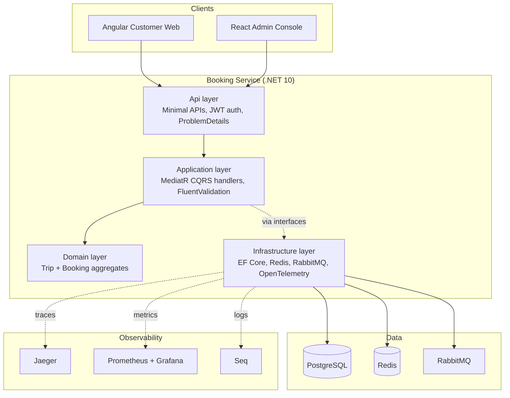

# Architecture overview

Narrative companion to the [C4 diagrams](../diagrams/C4_Context.md). Read
those for the visual model; this page is the "why".

## The shape of the system today

## Architectural decisions, and why

| Decision | Why | Where enforced |
|---|---|---|
| Clean Architecture (Domain has ~zero dependencies) | Business rules (seat holds, booking lifecycle) are testable without a database, and swappable infrastructure (e.g. Redis -> Memcached) doesn't touch domain code | `Domain.csproj` has one dependency (`MediatR.Contracts`); see [C4_Component.md](../diagrams/C4_Component.md) |
| Vertical slices inside Application | Each use case (`SearchTrips`, `CreateBooking`, ...) is a self-contained folder — you can delete a feature by deleting a folder, not hunting across `Services/`, `Repositories/`, `DTOs/` | `Application/Features/*` |
| CQRS via MediatR | Reads (`SearchTrips`) bypass aggregates entirely and project straight to DTOs; writes (`CreateBooking`) go through domain invariants. Different performance/consistency needs, different code paths | `Application/Features/Trips/SearchTrips` (read) vs `Application/Features/Bookings/CreateBooking` (write) |
| Optimistic concurrency via Postgres `xmin` | Seat double-booking must be *structurally* impossible, not just unlikely — `xmin` gives this for free without an app-managed version column | `TripConfiguration.cs`, `BookingConfiguration.cs`, verified under load by `performance-tests/*/create-booking-stress-test.*` |
| Transactional outbox | A booking's "created" event must never be lost even if the process crashes right after commit, and must never be published before the commit either | `Infrastructure/Persistence/Outbox/` |
| Redis cache-aside, fail-open | Search is the highest-traffic read; a Redis outage should degrade latency, not availability | `RedisCacheService.cs` — every method wraps Redis calls in try/catch and falls through to Postgres |
| Separate `Booking` and `Trip` aggregates (no DB foreign key) | They scale and change independently; the relationship is an application-layer invariant (see the sequence diagram), not a schema constraint | [ERD.md](../diagrams/ERD.md) |

## What's still a scaffold

Everything under `services/` other than `booking-service`, everything under
`shared/`, the API Gateway, and the mobile clients referenced in
`MASTER_SPEC.md`. See the root `README.md`'s "Known gaps" section for the
current, honest list.
