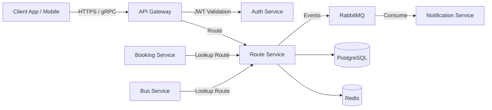
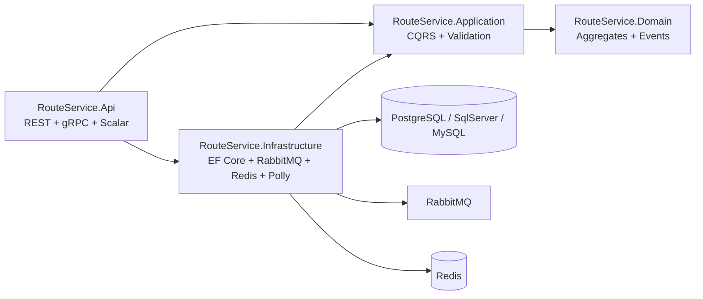
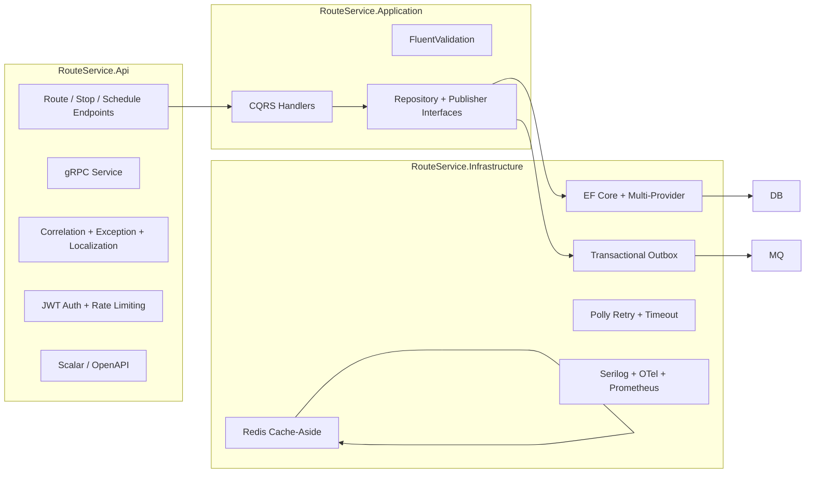
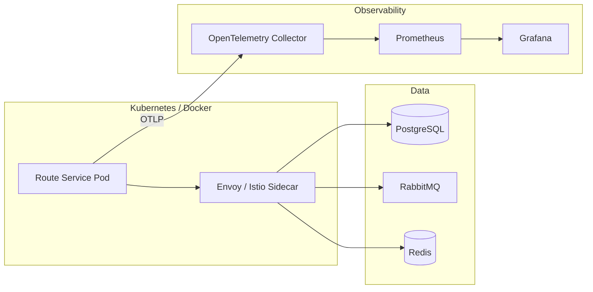

# C4 Diagrams — Route Service

## Context Diagram

```mermaid
graph LR
    Client[Client App / Mobile]
    Gateway[API Gateway]
    Auth[Auth Service]
    Booking[Booking Service]
    Bus[Bus Service]
    Route[Route Service]
    Notification[Notification Service]
    RabbitMQ[RabbitMQ]
    Postgres[(PostgreSQL)]
    Redis[(Redis)]

    Client -->|HTTPS / gRPC| Gateway
    Gateway -->|JWT Validation| Auth
    Gateway -->|Route| Route
    Booking -->|Lookup Route| Route
    Bus -->|Lookup Route| Route
    Route -->|Events| RabbitMQ
    RabbitMQ -->|Consume| Notification
    Route --> Postgres
    Route --> Redis
```

## Container Diagram

```mermaid
graph LR
    API[RouteService.Api<br/>REST + gRPC + Scalar]
    App[RouteService.Application<br/>CQRS + Validation]
    Domain[RouteService.Domain<br/>Aggregates + Events]
    Infra[RouteService.Infrastructure<br/>EF Core + RabbitMQ + Redis + Polly]
    DB[(PostgreSQL / SqlServer / MySQL)]
    MQ[RabbitMQ]
    Cache[(Redis)]

    API --> App
    App --> Domain
    API --> Infra
    Infra --> App
    Infra --> DB
    Infra --> MQ
    Infra --> Cache
```

## Component Diagram

```mermaid
graph LR
    subgraph RouteService.Api
        Endpoints[Route / Stop / Schedule Endpoints]
        Grpc[gRPC Service]
        Middleware[Correlation + Exception + Localization]
        Auth[JWT Auth + Rate Limiting]
        Docs[Scalar / OpenAPI]
    end

    subgraph RouteService.Application
        Handlers[CQRS Handlers]
        Validators[FluentValidation]
        Interfaces[Repository + Publisher Interfaces]
    end

    subgraph RouteService.Infrastructure
        Persistence[EF Core + Multi-Provider]
        Messaging[Transactional Outbox]
        Cache[Redis Cache-Aside]
        Resilience[Polly Retry + Timeout]
        Observability[Serilog + OTel + Prometheus]
    end

    Endpoints --> Handlers
    Handlers --> Interfaces
    Interfaces --> Persistence
    Interfaces --> Messaging
    Persistence --> DB
    Messaging --> MQ
    Cache --> Cache
```

## Deployment Diagram

```mermaid
graph LR
    subgraph Kubernetes / Docker
        Pod[Route Service Pod]
        sidecar[Envoy / Istio Sidecar]
    end

    subgraph Data
        DB[(PostgreSQL)]
        MQ[RabbitMQ]
        Cache[(Redis)]
    end

    subgraph Observability
        OTEL[OpenTelemetry Collector]
        Prom[Prometheus]
        Graf[Grafana]
    end

    Pod --> sidecar
    sidecar --> DB
    sidecar --> MQ
    sidecar --> Cache
    Pod -->|OTLP| OTEL
    OTEL --> Prom
    Prom --> Graf
```
