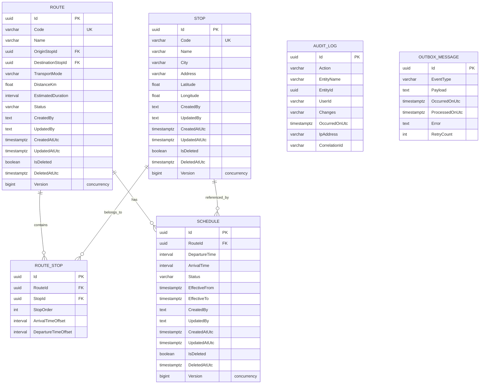

# Route Service — ER Diagram

```mermaid
erDiagram
    ROUTE ||--o{ ROUTE_STOP : contains
    ROUTE ||--o{ SCHEDULE : has
    STOP ||--o{ ROUTE_STOP : belongs_to
    STOP ||--o{ SCHEDULE : referenced_by

    ROUTE {
        uuid Id PK
        varchar Code "UK"
        varchar Name
        uuid OriginStopId FK
        uuid DestinationStopId FK
        varchar TransportMode
        float DistanceKm
        interval EstimatedDuration
        varchar Status
        text CreatedBy
        text UpdatedBy
        timestamptz CreatedAtUtc
        timestamptz UpdatedAtUtc
        boolean IsDeleted
        timestamptz DeletedAtUtc
        bigint Version "concurrency"
    }

    STOP {
        uuid Id PK
        varchar Code "UK"
        varchar Name
        varchar City
        varchar Address
        float Latitude
        float Longitude
        text CreatedBy
        text UpdatedBy
        timestamptz CreatedAtUtc
        timestamptz UpdatedAtUtc
        boolean IsDeleted
        timestamptz DeletedAtUtc
        bigint Version "concurrency"
    }

    ROUTE_STOP {
        uuid Id PK
        uuid RouteId FK
        uuid StopId FK
        int StopOrder
        interval ArrivalTimeOffset
        interval DepartureTimeOffset
    }

    SCHEDULE {
        uuid Id PK
        uuid RouteId FK
        interval DepartureTime
        interval ArrivalTime
        varchar Status
        timestamptz EffectiveFrom
        timestamptz EffectiveTo
        text CreatedBy
        text UpdatedBy
        timestamptz CreatedAtUtc
        timestamptz UpdatedAtUtc
        boolean IsDeleted
        timestamptz DeletedAtUtc
        bigint Version "concurrency"
    }

    AUDIT_LOG {
        uuid Id PK
        varchar Action
        varchar EntityName
        uuid EntityId
        varchar UserId
        varchar Changes
        timestamptz OccurredOnUtc
        varchar IpAddress
        varchar CorrelationId
    }

    OUTBOX_MESSAGE {
        uuid Id PK
        varchar EventType
        text Payload
        timestamptz OccurredOnUtc
        timestamptz ProcessedOnUtc
        text Error
        int RetryCount
    }
```
