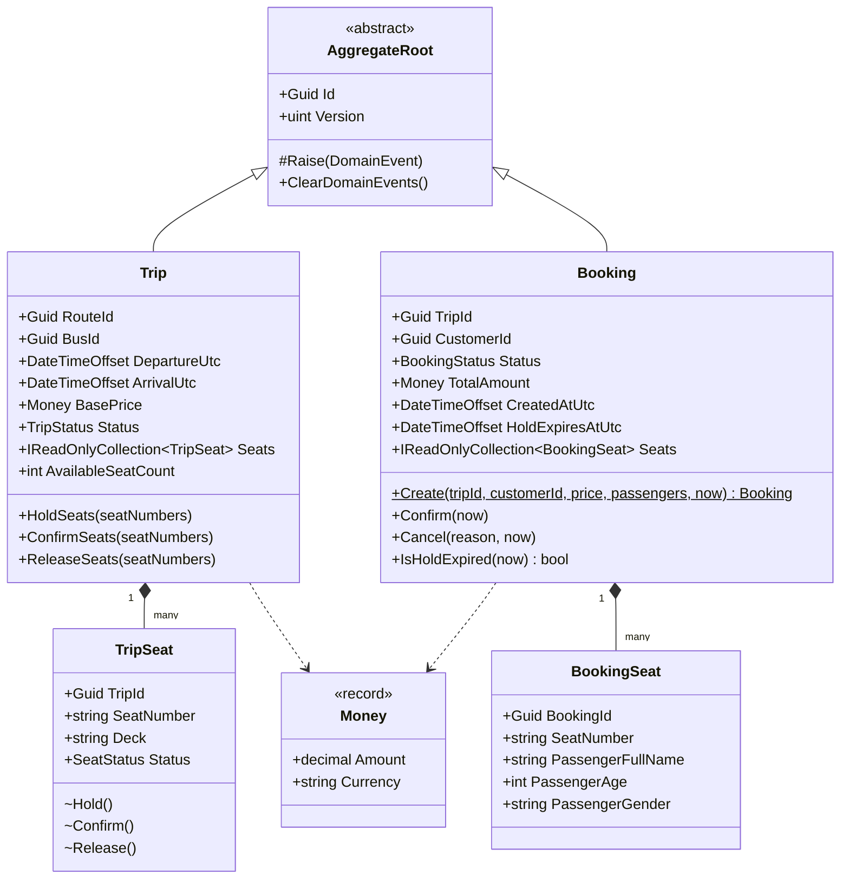

# C4 Model — Level 4: Code (Trip & Booking aggregates)

Class-level view of the two aggregates that carry the booking domain's core
invariant: a seat can never be sold twice. This matches the actual code in
`services/booking-service/src/BookingService.Domain/Entities/`.

## Why seat-double-booking is structurally hard to introduce

1. `TripSeat.Hold()`/`Confirm()`/`Release()` are `internal` — only `Trip`
   itself can call them, so no code outside the aggregate can flip a seat's
   status without going through `Trip.HoldSeats()`'s all-or-nothing check.
2. `Trip.HoldSeats()` throws `SeatUnavailableException` on the **first**
   already-taken seat in the batch, before mutating any of them — a
   multi-seat request either fully succeeds or fully fails, never partially.
3. `AggregateRoot.Version` is mapped to Postgres' `xmin` system column (see
   `TripConfiguration.cs`), so even two requests that both read the seat as
   "Available" at the same instant can't both commit — the second
   `SaveChangesAsync()` throws `DbUpdateConcurrencyException`, which
   `CreateBookingHandler` translates back into the same `409 Conflict` a
   same-transaction conflict would produce.

`performance-tests/k6/create-booking-stress-test.js` and its NBomber/JMeter
equivalents exist specifically to verify point 3 under real concurrent load,
not just point 1-2 in a single-threaded unit test.
