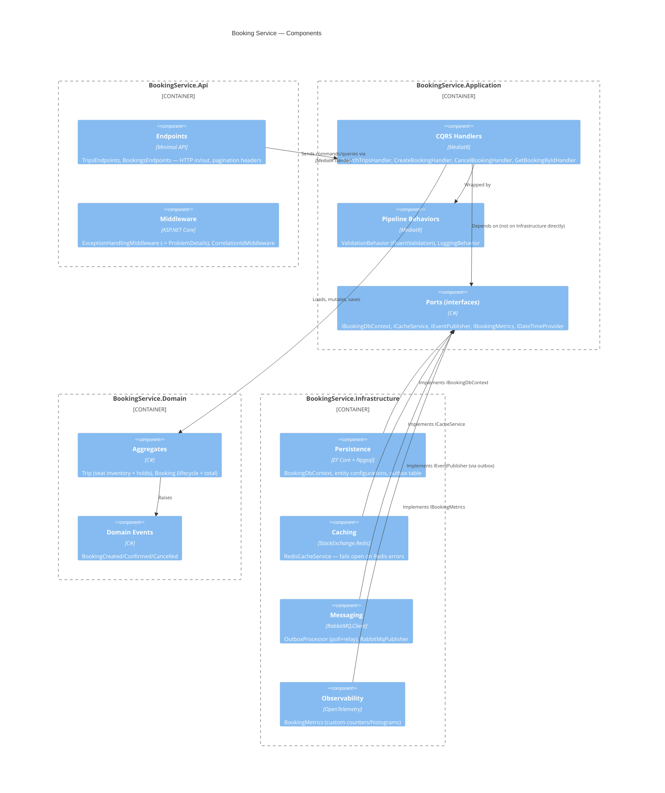

# C4 Model — Level 3: Component (Booking Service)

Inside the Booking Service container: the four Clean Architecture layers and
their real dependency direction (arrows point toward the Domain — nothing in
Domain knows about EF Core, Redis, or ASP.NET).

## The rule this diagram is actually enforcing

`BookingService.Domain` has exactly one dependency: `MediatR.Contracts`, for
the `INotification` marker interface domain events implement (see the
comment in `Domain/Common/DomainEvent.cs` for why that's a deliberate,
narrow exception). Everything else — EF Core, Redis, RabbitMQ, ASP.NET —
lives in `Infrastructure` or `Api`, reached only through interfaces defined
in `Application`. That's what makes `CreateBookingHandlerTests.cs` able to
run against an in-memory EF provider and a fake cache with zero real
infrastructure spun up.

See [C4_Code.md](./C4_Code.md) for the class-level shape of the Booking/Trip aggregates.
