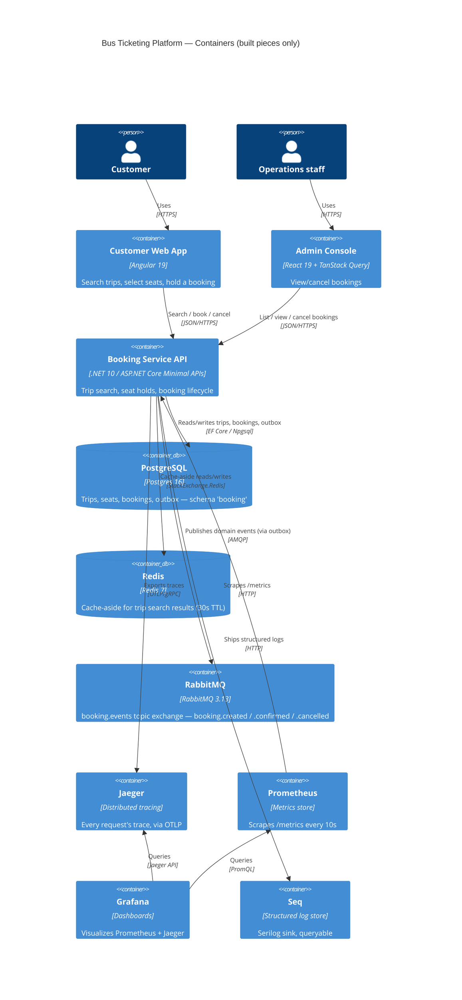

# C4 Model — Level 2: Container

What's inside the platform: services, datastores, and the observability
stack, and how they actually talk to each other today.

## Not built yet (from MASTER_SPEC.md)

API Gateway (YARP/Ocelot) in front of the services, Identity/Auth Service,
Route Service, Bus/Fleet Service, Payment Service, Notification Service —
these are folders under `services/` today with no implementation. The
Booking Service currently accepts requests directly (no gateway hop) and
validates its own JWTs, which is intentionally how it's designed to keep
working once a gateway is added in front of it (see the comment in
`Program.cs` about defense-in-depth JWT validation).

See [C4_Component.md](./C4_Component.md) for what's inside the Booking Service container.
