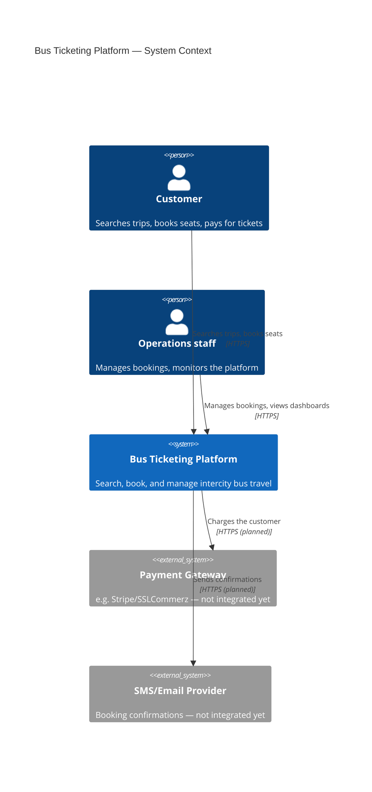

# C4 Model — Level 1: System Context

Who uses the platform, and what other systems it talks to. This is the
target state from `MASTER_SPEC.md`; boxes marked **(built)** exist today,
everything else is planned.

## Built vs planned

| Actor / system | Status |
|---|---|
| Customer -> Platform (search, book) | **Built** — `apps/angular-client` + `services/booking-service` |
| Operations staff -> Platform (manage bookings) | **Built** — `apps/react-admin` + `services/booking-service` |
| Platform -> Payment Gateway | Planned — see `services/payment-service` (scaffold only) |
| Platform -> SMS/Email Provider | Planned — see `services/notification-service` (scaffold only) |

See [C4_Container.md](./C4_Container.md) for what's inside "Bus Ticketing Platform".
