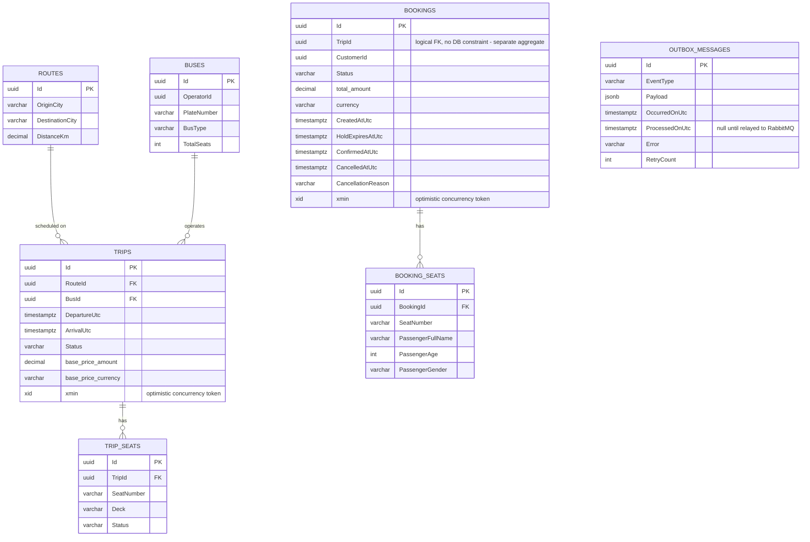

# Entity-Relationship Diagram

Matches the real EF Core configuration in
`services/booking-service/src/BookingService.Infrastructure/Persistence/Configurations/`
— not an aspirational schema. All tables live in the Postgres `booking`
schema. Column names are PascalCase (EF Core's default convention) **except**
the owned `Money` columns, which were explicitly mapped to snake_case — see
`scripts/seed-demo-data.sql`'s header comment for why that's not a typo.

## Why `Bookings.TripId` has no database foreign key

`Trip` and `Booking` are deliberately separate aggregates (see
[C4_Code.md](./C4_Code.md)) — a `Booking` references a `TripId` by value, not
by navigation property, so the two can be persisted/scaled independently.
The relationship is enforced at the application layer
(`CreateBookingHandler` loads the `Trip` before creating the `Booking`, in
the same transaction), not by a Postgres `FOREIGN KEY` constraint.

## `xmin` instead of a manual `RowVersion` column

Both `TRIPS` and `BOOKINGS` use Postgres' native `xmin` system column as
their EF Core concurrency token (`.HasColumnName("xmin").IsRowVersion()` in
the configurations) rather than adding an application-managed
`RowVersion`/`Timestamp` column — one less column to keep in sync, and the
database bumps it for free on every `UPDATE`.

## Indexes worth knowing about

- `trips (RouteId, DepartureUtc)` — the exact shape `SearchTrips` filters on
- `trip_seats (TripId, SeatNumber)` — unique, prevents duplicate seat rows
- `bookings (CustomerId)`, `bookings (TripId)` — "my bookings" and
  "bookings for this trip" lookups
- `outbox_messages (ProcessedOnUtc, OccurredOnUtc)` — the exact shape
  `OutboxProcessor` polls on ("give me unprocessed messages, oldest first")
