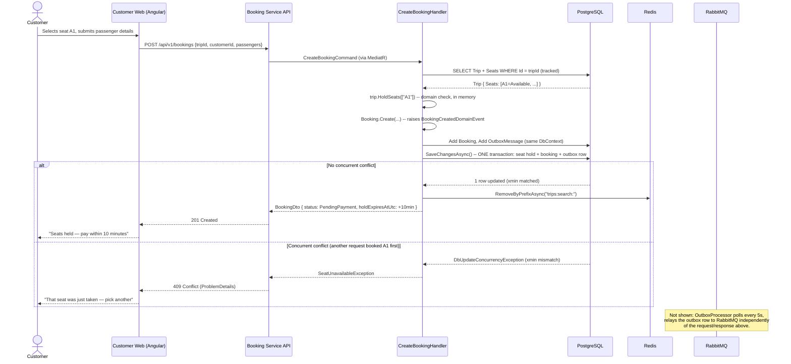
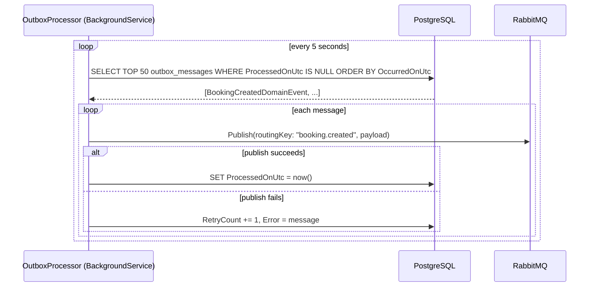
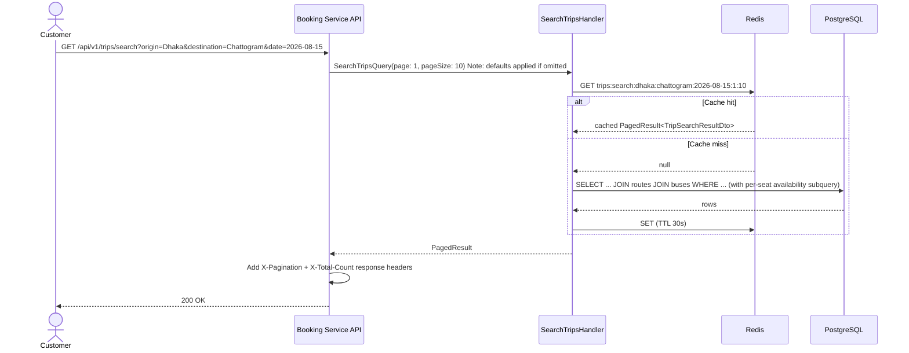

# Sequence diagrams

## Create booking (happy path + the concurrency conflict path)

## Outbox relay (decoupled from the request above)

This is what makes booking creation reliable even if the process crashes
between the HTTP response and the RabbitMQ publish — the event is already
durably stored in the same transaction as the booking itself, and the
processor will pick it up on the next poll after a restart.

## Trip search with cache-aside

See [../OBSERVABILITY_GUIDE.md](../OBSERVABILITY_GUIDE.md) to watch these
exact flows happen live in Jaeger/Grafana/Seq.
