# C4 Code Diagram

```mermaid
graph TD
    subgraph "BusService.Domain"
        BusAgg["Bus (AggregateRoot)"]
        DepotEnt["Depot (Entity)"]
        BusRepo["IBusRepository (Interface)"]
        BusEvents["BusRegisteredDomainEvent<br/>BusDetailsUpdatedDomainEvent<br/>BusStatusChangedDomainEvent<br/>BusSoftDeletedDomainEvent<br/>BusRestoredDomainEvent"]
        BusEx["BusNotFoundException<br/>DuplicatePlateNumberException<br/>InvalidBusStatusTransitionException"]
        BusEnum["BusStatus (Active, UnderMaintenance, Retired)<br/>BusType (AcSleeper, NonAcSleeper, ...)"]
    end

    subgraph "BusService.Application"
        RegisterCmd["RegisterBusCommand + Handler + Validator"]
        GetBusQ["GetBusQuery + Handler"]
        GetBusesQ["GetBusesQuery + Handler"]
        UpdateCmd["UpdateBusDetailsCommand + Handler + Validator"]
        StatusCmd["ChangeBusStatusCommand + Handler + Validator"]
        SoftDelCmd["SoftDeleteBusCommand + Handler + Validator"]
        RestoreCmd["RestoreBusCommand + Handler + Validator"]
        CreateDepotCmd["CreateDepotCommand + Handler + Validator"]
        GetDepotsQ["GetDepotsQuery + Handler"]
        SoftDelDepotCmd["SoftDeleteDepotCommand + Handler + Validator"]
        RestoreDepotCmd["RestoreDepotCommand + Handler + Validator"]
        DTOs["BusDto, DepotDto, PagedResult<T>, Result<T>"]
    end

    subgraph "BusService.Infrastructure"
        DbCtx["BusDbContext"]
        BusConfig["BusConfiguration (IEntityTypeConfiguration)"]
        DepotConfig["DepotConfiguration"]
        AuditConfig["AuditLogConfiguration"]
        OutboxConfig["OutboxMessageConfiguration"]
        BusRepoImpl["BusRepository"]
        AuditLogRepo["AuditLogRepository"]
        OutboxPub["OutboxEventPublisher"]
        OutboxProc["OutboxProcessor"]
        RedisCache["RedisCacheService"]
        JsonLoc["JsonLocalizationService"]
        DateTimeProv["DateTimeProvider"]
    end

    BusAgg --> BusEvents
    BusAgg --> BusEx
    BusAgg --> BusEnum
    RegisterCmd --> BusAgg
    UpdateCmd --> BusAgg
    StatusCmd --> BusAgg
    SoftDelCmd --> BusAgg
    RestoreCmd --> BusAgg
    GetBusQ --> DTOs
    GetBusesQ --> DTOs
    BusRepoImpl --> DbCtx
    DbCtx --> BusConfig
    DbCtx --> DepotConfig
    DbCtx --> AuditConfig
    DbCtx --> OutboxConfig
    OutboxPub --> DbCtx
    AuditLogRepo --> DbCtx
```

## Description

- **Domain Layer**: `Bus` is the aggregate root enforcing lifecycle rules. `Depot` is a standalone entity. Domain events flow from the aggregate to the outbox.
- **Application Layer**: One vertical slice per feature — each command/query has its own handler, validator, and (for commands) pipeline behavior.
- **Infrastructure Layer**: EF Core configurations map domain types to tables. Repositories abstract data access. `OutboxProcessor` runs as a hosted service, polling for unprocessed messages and publishing to RabbitMQ.
