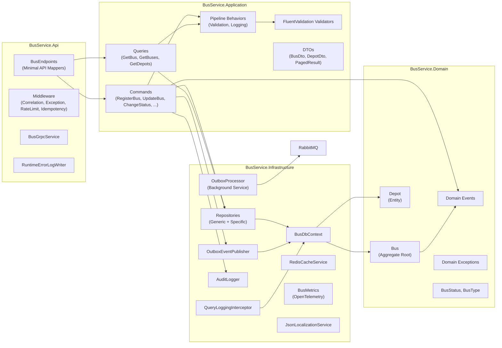

# C4 Component Diagram

## Description

- **Endpoints**: Map HTTP/gRPC routes, enforce auth/rate-limiting, delegate to MediatR.
- **Middleware**: Cross-cutting concerns — correlation ID, exception shaping, request context, idempotency, rate limiting.
- **Pipeline Behaviors**: Validation (FluentValidation) and logging wrap every command/query.
- **Repositories**: Implement `IBusDbContext`, encapsulate EF Core queries.
- **Outbox**: `OutboxEventPublisher` persists domain events within the same transaction; `OutboxProcessor` (hosted service) dispatches to RabbitMQ.
- **AuditLogger**: Records every write operation with user, changes, IP, and correlation ID.
- **QueryLoggingInterceptor**: Optional EF Core interceptor for diagnostic SQL logging.
