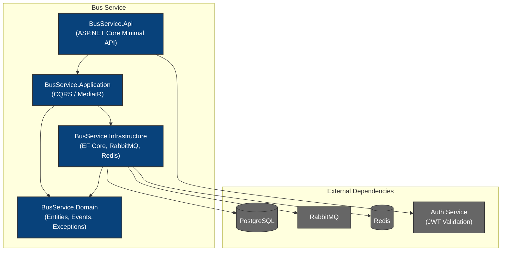

# C4 Container Diagram

## Description

- **BusService.Api**: Minimal API endpoints, JWT auth, OpenAPI/Scalar, gRPC, health checks, middleware pipeline.
- **BusService.Application**: CQRS commands/queries, validators, domain event handlers, DTOs.
- **BusService.Infrastructure**: EF Core repositories, outbox publisher/processor, Redis cache, query logging interceptor.
- **BusService.Domain**: Aggregate roots (`Bus`, `Depot`), domain events, exceptions, enums, value objects.
- **PostgreSQL**: Primary datastore with provider portability (Postgres/SqlServer/MySql).
- **RabbitMQ**: Event publishing via transactional outbox pattern.
- **Redis**: Response caching for read endpoints.
- **Auth Service**: External JWT validation — same signing key/issuer/audience configuration.
