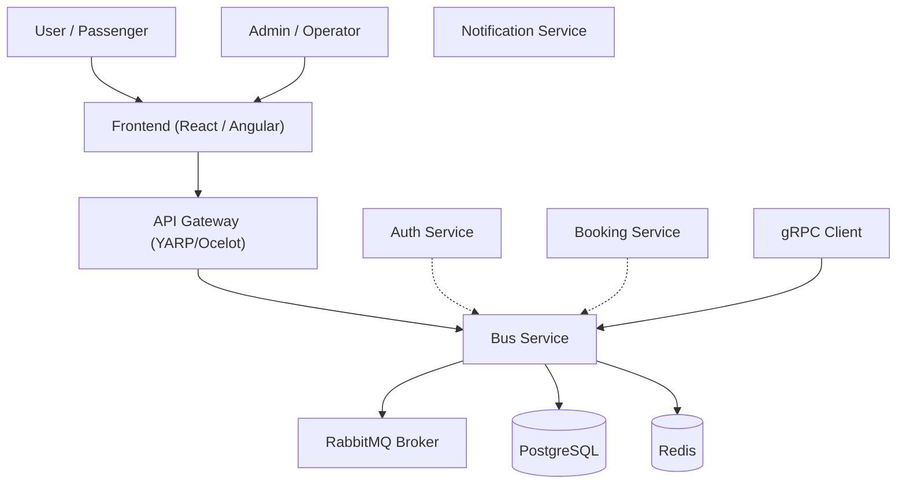

# C4 Context Diagram

## Description

- **Users** interact with the platform through the Frontend, which routes through the API Gateway.
- **Auth Service** issues JWTs that Bus Service validates for authentication and authorization.
- **Booking Service** consumes bus domain events published by Bus Service to keep its read model in sync.
- **Notification Service** may consume bus events for operational alerts (e.g., bus retired).
- **Bus Service** publishes domain events to RabbitMQ (`bus.events` exchange).
- Data is persisted in **PostgreSQL** with **Redis** for caching.
- **gRPC** is exposed for internal service-to-service communication.
