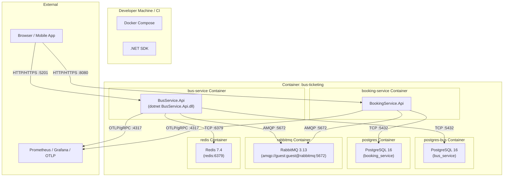

# C4 Deployment Diagram

## Description

- **Bus Service** runs in its own container, built from `src/BusService.Api/Dockerfile`.
- **PostgreSQL** is isolated per-service (`bus_service` database on port 5434, `booking_service` on 5432) to prevent coupling.
- **RabbitMQ** is shared — services communicate via exchanges (`bus.events`, `booking.events`, etc.).
- **Redis** is shared for caching across services.
- **Health checks** verify Postgres, Redis, and RabbitMQ availability before the app starts accepting traffic.
- **OpenTelemetry** exports traces and metrics to an OTLP collector (e.g., Jaeger, Prometheus).
