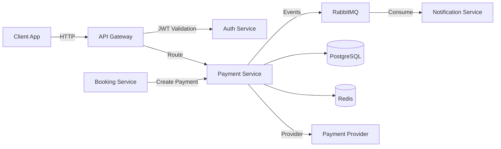
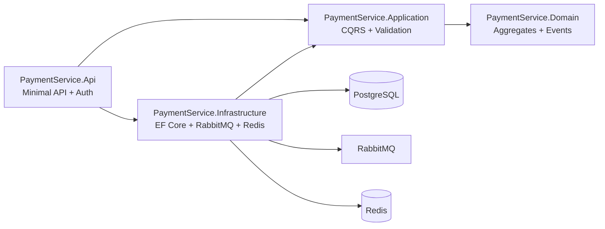
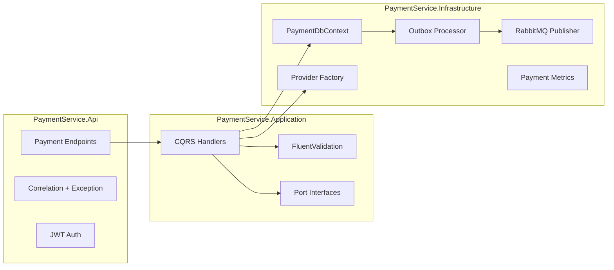
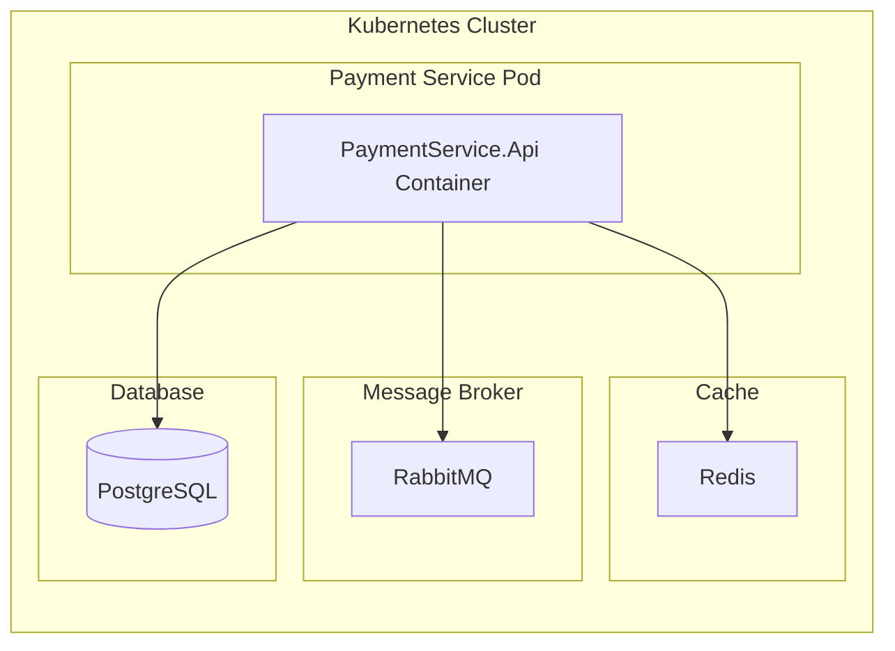

# C4 Diagrams - Payment Service

## Context Diagram

```mermaid
graph LR
    Client[Client App]
    Gateway[API Gateway]
    Auth[Auth Service]
    Booking[Booking Service]
    Payment[Payment Service]
    Notification[Notification Service]
    RabbitMQ[RabbitMQ]
    PostgreSQL[(PostgreSQL)]
    Redis[(Redis)]

    Client -->|HTTP| Gateway
    Gateway -->|JWT Validation| Auth
    Gateway -->|Route| Payment
    Booking -->|Create Payment| Payment
    Payment -->|Events| RabbitMQ
    RabbitMQ -->|Consume| Notification
    Payment --> PostgreSQL
    Payment --> Redis
    Payment -->|Provider| ExternalProvider[Payment Provider]
```

## Container Diagram

```mermaid
graph LR
    API[PaymentService.Api<br/>Minimal API + Auth]
    App[PaymentService.Application<br/>CQRS + Validation]
    Domain[PaymentService.Domain<br/>Aggregates + Events]
    Infra[PaymentService.Infrastructure<br/>EF Core + RabbitMQ + Redis]
    DB[(PostgreSQL)]
    MQ[RabbitMQ]
    Cache[(Redis)]

    API --> App
    App --> Domain
    API --> Infra
    Infra --> App
    Infra --> DB
    Infra --> MQ
    Infra --> Cache
```

## Component Diagram

```mermaid
graph LR
    subgraph PaymentService.Api
        Endpoints[Payment Endpoints]
        Middleware[Correlation + Exception]
        Auth[JWT Auth]
    end

    subgraph PaymentService.Application
        Handlers[CQRS Handlers]
        Validators[FluentValidation]
        Interfaces[Port Interfaces]
    end

    subgraph PaymentService.Infrastructure
        DbContext[PaymentDbContext]
        Outbox[Outbox Processor]
        Publisher[RabbitMQ Publisher]
        Metrics[Payment Metrics]
        ProviderFactory[Provider Factory]
    end

    Endpoints --> Handlers
    Handlers --> Interfaces
    Handlers --> Validators
    Handlers --> DbContext
    DbContext --> Outbox
    Outbox --> Publisher
    Handlers --> ProviderFactory
```

## Deployment Diagram

```mermaid
graph LR
    subgraph Kubernetes Cluster
        subgraph Payment Service Pod
            Container[PaymentService.Api Container]
        end
        subgraph Message Broker
            RabbitMQ[RabbitMQ]
        end
        subgraph Cache
            Redis[Redis]
        end
        subgraph Database
            PostgreSQL[(PostgreSQL)]
        end
    end

    Container --> RabbitMQ
    Container --> Redis
    Container --> PostgreSQL
```
