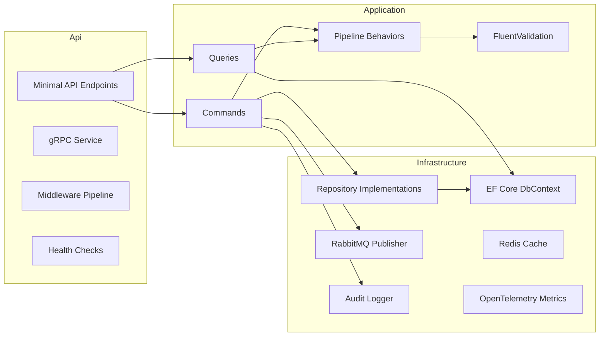

# Diagrams — C4 Component

```mermaid
graph LR
    subgraph Api
        Endpoints[Minimal API Endpoints]
        Grpc[gRPC Service]
        Middleware[Middleware Pipeline]
        Health[Health Checks]
    end
    subgraph Application
        Commands[Commands]
        Queries[Queries]
        Validators[FluentValidation]
        Behaviors[Pipeline Behaviors]
    end
    subgraph Infrastructure
        DbContext[EF Core DbContext]
        Repo[Repository Implementations]
        Publisher[RabbitMQ Publisher]
        Cache[Redis Cache]
        Metrics[OpenTelemetry Metrics]
        Audit[Audit Logger]
    end
    Endpoints --> Commands
    Endpoints --> Queries
    Commands --> Behaviors
    Queries --> Behaviors
    Behaviors --> Validators
    Commands --> Repo
    Queries --> DbContext
    Repo --> DbContext
    Commands --> Publisher
    Commands --> Audit
```
