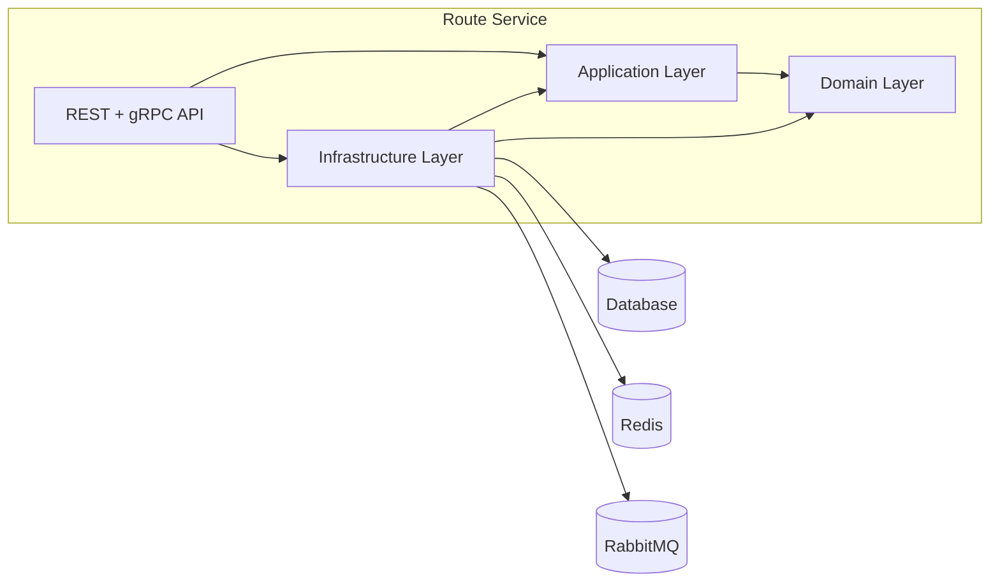

# Diagrams — C4 Container

```mermaid
graph LR
    subgraph Route Service
        Api[REST + gRPC API]
        App[Application Layer]
        Infra[Infrastructure Layer]
        Domain[Domain Layer]
    end
    Api --> App
    App --> Domain
    Infra --> Domain
    Infra --> App
    Api --> Infra
    Infra --> Database[(Database)]
    Infra --> Redis[(Redis)]
    Infra --> RabbitMQ[(RabbitMQ)]
```
