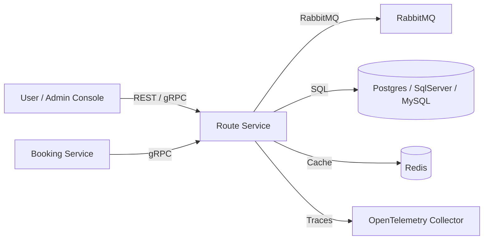

# Diagrams — C4 Context

```mermaid
graph LR
    User[User / Admin Console] -->|REST / gRPC| RouteService[Route Service]
    BookingService[Booking Service] -->|gRPC| RouteService
    RouteService -->|RabbitMQ| MessageBroker[RabbitMQ]
    RouteService -->|SQL| Database[(Postgres / SqlServer / MySQL)]
    RouteService -->|Cache| Redis[(Redis)]
    RouteService -->|Traces| OTel[OpenTelemetry Collector]
```
